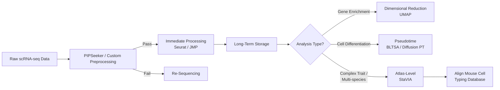

# 🧬 Single-Cell Transcriptomics Docker Workflow

This repository provides a modular, containerized workflow for **single-cell RNA sequencing (scRNA-seq) data analysis**, supporting both **dense and sparse matrix inputs**.  
While **PIPSeeker** is the default preprocessing module, the workflow is compatible with any equivalent tool that outputs a valid **matrix format** (e.g. `.mtx`, `.h5ad`, `.loom`, `.csv`).

---

## ⚡ Quick Start Diagram (Mermaid)



---

## 📊 Workflow Overview

This workflow automates end-to-end single-cell data processing — from initial QC and normalization to pseudotime and multi-species comparison.

```
 ┌────────────────────────┐
 │   Initial Processing   │  ← PIPSeeker or user-defined QC
 └──────────┬─────────────┘
            │ Pass
            ▼
 ┌───────────────────────────────┐
 │  Filtering and Concatenation  │  ← Seurat / JMP
 └──────────┬────────────────────┘
            │
            ▼
 ┌────────────────────────┐
 │    Analysis Decision   │
 └──────────┬─────────────┘
    │ Simple Gene Enrichment → UMAP
    │ Cell Differentiation → Pseudotime (BLTSA/Diffusion PT)
    └ Complex Trait Analysis → Atlas-Level (StaVIA)
```

---

## 🧱 Dockerized Components

Each stage runs in its own container for reproducibility, scalability, and portability.

| Module | Docker Image | Description |
|---------|---------------|-------------|
| **Initial Processing** | `snRN_AI/core:latest` | Optional preprocessing (QC, filtering, normalization). Accepts `.mtx`, `.h5ad`, `.loom`, `.csv`. |
| **Immediate Processing** | `snRN_AI/immediate:latest` | Rapid exploratory analysis using Seurat, JMP, or PIPSeeker. |
| **Dimensional Reduction** | `snRN_AI/umap:latest` | UMAP / PCA visualization for sample exploration. |
| **Pseudotime Analysis** | `snRN_AI/pseudotime:latest` | Runs BLTSA or Diffusion Pseudotime analysis. |
| **Atlas-Level Analysis** | `snRN_AI/atlas:latest` | Multi-species and complex trait pseudotime via StaVIA. |
| **Mouse Reference Alignment** | `snRN_AI/mouse-db_classical:latest` | Aligns results with reference mouse cell-type databases. |

---

## 📂 Directory Structure

```
project_root/
├── config/
│   └── config.yaml               # Workflow configuration
├── input/
│   ├── dataset.mtx               # Sparse matrix input (optional)
│   ├── dataset.h5ad              # Dense matrix input (optional)
│   └── metadata.csv              # Cell/barcode metadata
├── output/
│   ├── processed/                # Immediate outputs (Seurat, UMAP, etc.)
│   ├── pseudotime/               # BLTSA, Diffusion PT, StaVIA results
│   └── visualization/            # UMAP / PCA figures
├── archive/
│   └── long_term_storage/        # Compressed sparse matrices
├── docker/
│   ├── Dockerfile.pipseeker
│   ├── Dockerfile.umap
│   └── Dockerfile.pseudotime
└── docker-compose.yml
```

---

## ⚙️ Configuration (`config/config.yaml`)

Example configuration file to control module execution and parameters:

```yaml
input:
  matrix_path: "./input/dataset.mtx"
  metadata_path: "./input/metadata.csv"
  input_format: "mtx"  # Options: mtx, h5ad, loom, csv

processing:
  use_pipseeker: true
  min_genes_per_cell: 200
  min_cells_per_gene: 3

analysis:
  run_umap: true
  run_pseudotime: true
  run_atlas_alignment: false

output:
  results_dir: "./output/"
  storage_dir: "./archive/"
```

---

## 🧩 Example `docker-compose.yml`

```yaml
version: "3.8"
services:
  preproc:
    image: pipseeker/core:latest
    volumes:
      - ./input:/data/input
      - ./output:/data/output
      - ./config:/config
    command: ["--config", "/config/config.yaml"]

  immediate:
    image: pipseeker/immediate:latest
    depends_on: [preproc]
    volumes:
      - ./output:/data/output
    command: ["--mode", "explore"]

  pseudotime:
    image: pipseeker/pseudotime:latest
    depends_on: [immediate]
    volumes:
      - ./output:/data/output
    command: ["--method", "bltsa"]

  atlas:
    image: pipseeker/atlas:latest
    depends_on: [pseudotime]
    volumes:
      - ./output:/data/output
    command: ["--ref", "/data/mouse-db"]

  mouse-db:
    image: pipseeker/mouse-db:latest
    volumes:
      - ./output:/data/output
```

---

## 🚀 Usage

### 1. Clone Repository
```bash
git clone https://github.com/<your-org>/scRNA-docker-pipeline.git
cd scRNA-docker-pipeline
```

### 2. Build or Pull Images
```bash
docker compose build
# or pull pre-built images
docker compose pull
```

### 3. Run Workflow
```bash
docker compose up
```

### 4. Inspect Results
- Processed data: `./output/processed/`
- Pseudotime trajectories: `./output/pseudotime/`
- Archived matrices: `./archive/long_term_storage/`

---

## 🧠 Notes

- **PIPSeeker is optional** — any preprocessing tool that generates valid sparse or dense matrices can be used.
- The workflow supports modular execution — run individual containers or compose the full pipeline.
- All parameters and paths are configurable via `config/config.yaml`.
- Compatible with both local and cloud container orchestration (Docker Compose, Slurm, or AWS Batch).

---

## 📜 Citation

If you use this workflow, please cite:
- Relevant single-cell analysis tools (Seurat, BLTSA, StaVIA, etc.)
- The PIPSeeker or alternative preprocessing framework you employed
- This Dockerized workflow repository (once published)

---

**Maintainer:** [Your Name or Organization]  
**License:** MIT  
**Contact:** [your.email@domain.com]
