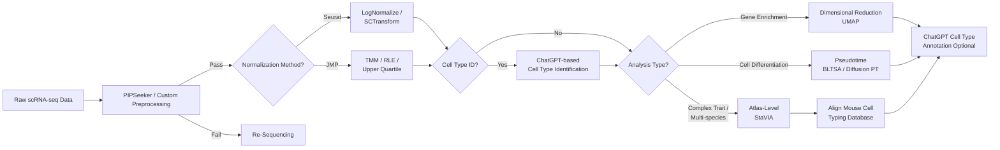

# Single-Cell Transcriptomics Docker Workflow

This repository provides a modular, containerized workflow for **single-cell RNA sequencing (scRNA-seq) data analysis**, supporting both **dense and sparse matrix inputs**.  
While **PIPSeeker** is the default preprocessing module, the workflow is compatible with any equivalent tool that outputs a valid **matrix format** (e.g. `.mtx`, `.h5ad`, `.loom`, `.csv`).

---

## Quick Start Diagram (Mermaid)



---

## Workflow Overview

This workflow automates end-to-end single-cell data processing — from initial QC and normalization to pseudotime and multi-tissue comparison.

```
 ┌────────────────────────┐
 │   Initial Processing   │  ← PIPSeeker or user-defined QC
 └──────────┬─────────────┘
            │ Pass
            ▼
 ┌───────────────────────────────┐
 │   Normalization Selection     │
 └──────────┬────────────────────┘
    │ Seurat → LogNormalize / SCTransform
    │ JMP → TMM / RLE / Upper Quartile
            ▼
 ┌────────────────────────────────────┐
 │  ChatGPT Cell Type Identification  │  ← Optional pre-analysis step
 │  (Marker gene-based annotation)    │
 └──────────┬─────────────────────────┘
            ▼
 ┌────────────────────────┐
 │    Analysis Decision   │
 └──────────┬─────────────┘
    │ Simple Gene Enrichment → UMAP
    │ Cell Differentiation → Pseudotime (BLTSA/Diffusion PT)
    │ Complex Trait Analysis → Atlas-Level (StaVIA)
            ▼
 ┌────────────────────────────────────┐
 │  ChatGPT Cell Type Annotation      │  ← Optional post-analysis step
 │  (Refine clusters, validate types) │
 └────────────────────────────────────┘
```

---

## Unified Docker Container

The workflow runs in a **single, unified Docker container** (`sc_toolkit`) that includes all analysis modules for reproducibility and portability. The container is built with:

- **Base OS**: Ubuntu 24.04 LTS
- **Environment Manager**: Micromamba for fast, lightweight package management
- **R Environment**: Includes BLTSA, destiny, and Bioconductor packages
- **Python Environment**: Scanpy, scVI-tools, and analysis frameworks (defined in `env.yml`)

### Current Capabilities

| Module | Implementation | Description |
|---------|---------------|-------------|
| **Initial Processing** | CLI: `sc_toolkit preprocess` | QC, filtering, normalization. Accepts `.mtx`, `.h5ad`, `.loom`, `.csv`. |
| **Normalization** | CLI: `sc_toolkit normalize` | Seurat (LogNormalize, SCTransform) or JMP (TMM, RLE, Upper Quartile) methods. |
| **AI Cell Type Identification** | CLI: `sc_toolkit AItyping` | **NEW** - AI-powered cell type identification using marker genes and ChatGPT API. |
| **Dimensional Reduction** | CLI: `sc_toolkit umap` | UMAP / PCA visualization for sample exploration. |
| **Pseudotime Analysis** | CLI: `sc_toolkit pseudotime` | BLTSA (R-based) or Diffusion Pseudotime analysis. |

### Planned Expansions

| Module | Status | Description |
|---------|--------|-------------|
| **Atlas-Level Analysis** | In Development | Multi-species and complex trait pseudotime via StaVIA (separate Docker container). |
| **Mouse and Human Reference Alignment** | Planned | Aligns results with reference mouse and human cell-type databases. |

### Docker Build

The Dockerfile uses a **multi-stage build** for optimization:

**Stage 1**: Base OS with build utilities  
**Stage 2**: Micromamba installation and Python/R environment setup  
**Stage 3**: BLTSA (R package) installation and CLI configuration

```bash
# Build the unified image
docker build -t sc_toolkit:0.1 .

# Run interactively
docker run -it --rm -v $(pwd)/data:/data sc_toolkit:0.1 --help
```

---

## Directory Structure

```
project_root/
├── Dockerfile                    # Unified container build
├── env.yml                       # Conda environment specification
├── config/
│   └── config.yaml               # Workflow configuration
├── input/
│   ├── dataset.mtx               # Sparse matrix input (optional)
│   ├── dataset.h5ad              # Dense matrix input (optional)
│   └── metadata.csv              # Cell/barcode metadata
├── output/
│   ├── normalized/               # Normalized matrices (Seurat/JMP)
│   ├── cell_types/               # ChatGPT cell type annotations (planned)
│   ├── processed/                # UMAP, clustering results
│   ├── pseudotime/               # BLTSA, Diffusion PT results
│   └── visualization/            # UMAP / PCA figures
└── sc_toolkit/                   # Python CLI source code
    ├── cli.py                    # Main CLI entrypoint
    ├── main.py                   # Workflow orchestration
    ├── small.py                  # Small dataset workflows
    ├── large.py                  # Large dataset workflows
    └── utils/                    # Utility modules
        ├── normalization.py
        ├── plot.py
        ├── export.py
        └── merge.py
```

---

## Configuration (`config/config.yaml`)

Example configuration file to control module execution and parameters:

```yaml
input:
  matrix_path: "./input/dataset.mtx"
  metadata_path: "./input/metadata.csv"
  input_format: "mtx"  # Options: mtx, h5ad, loom, csv

processing:
  use_pipseeker: true
  min_genes_per_cell: 200
  min_cells_per_gene: 3

normalization:
  method: "seurat"  # Options: seurat, jmp
  seurat_method: "LogNormalize"  # Options: LogNormalize, SCTransform
  jmp_method: "TMM"  # Options: TMM, RLE, UpperQuartile
  scale_factor: 10000

AItyping:
  enabled: true
  timing: "pre_analysis"  # Options: pre_analysis, post_analysis, both
  model: "gpt-4"  # Options: gpt-4, gpt-4-turbo, gpt-3.5-turbo
  api_key: "${OPENAI_API_KEY}"  # Set via environment variable
  marker_genes_auto: true  # Auto-detect from top variable genes
  custom_markers: []  # Optional: provide custom marker gene list
  confidence_threshold: 0.7
  max_clusters: 50  # Maximum number of clusters to annotate
  
analysis:
  run_umap: true
  run_pseudotime: true
  run_atlas_alignment: false

output:
  results_dir: "./output/"
```

---

## Running the Workflow

### Option 1: Command-Line Interface (Recommended)

The `sc_toolkit` CLI provides direct access to all workflow modules:

```bash
# Build the Docker image
docker build -t sc_toolkit:0.1 .

# Run preprocessing
docker run -v $(pwd)/data:/data sc_toolkit:0.1 preprocess \
    --input /data/input/dataset.h5ad \
    --output /data/output/processed.h5ad \
    --min-genes 200 --min-cells 3

# Run normalization
docker run -v $(pwd)/data:/data sc_toolkit:0.1 normalize \
    --input /data/output/processed.h5ad \
    --method seurat \
    --algorithm LogNormalize

# Run UMAP
docker run -v $(pwd)/data:/data sc_toolkit:0.1 umap \
    --input /data/output/normalized.h5ad \
    --output /data/output/umap.png

# Run AI-powered cell type identification
docker run -v $(pwd)/data:/data sc_toolkit:0.1 AItyping \
    --input /data/output/normalized.h5ad \
    --output /data/output/cell_types/ \
    --timing pre_analysis

# Run UMAP with cell type labels
docker run -v $(pwd)/data:/data sc_toolkit:0.1 umap \
    --input /data/output/normalized.h5ad \
    --output /data/output/umap.png \
    --cell-types /data/output/cell_types/annotations.csv

# Run BLTSA pseudotime
docker run -v $(pwd)/data:/data sc_toolkit:0.1 pseudotime \
    --input /data/output/normalized.h5ad \
    --method bltsa \
    --output /data/output/pseudotime/

# Optional: Run post-analysis cell type refinement
docker run -v $(pwd)/data:/data sc_toolkit:0.1 AItyping \
    --input /data/output/pseudotime/results.h5ad \
    --output /data/output/cell_types/ \
    --timing post_analysis
```

### Option 2: Docker Compose (Full Pipeline Orchestration)

For automated pipeline execution with all modules:

```yaml
version: "3.8"
services:
  sc_toolkit:
    build: .
    image: sc_toolkit:0.1
    volumes:
      - ./data:/data
      - ./config:/config
    environment:
      - OPENAI_API_KEY=${OPENAI_API_KEY}
    command: ["--config", "/config/config.yaml"]

  # Run with specific modules
  preprocess:
    image: sc_toolkit:0.1
    volumes:
      - ./data:/data
    command: ["preprocess", "--input", "/data/input/dataset.h5ad"]

  normalize:
    image: sc_toolkit:0.1
    depends_on: [preprocess]
    volumes:
      - ./data:/data
    command: ["normalize", "--input", "/data/output/processed.h5ad"]

  AItyping:
    image: sc_toolkit:0.1
    depends_on: [normalize]
    volumes:
      - ./data:/data
    environment:
      - OPENAI_API_KEY=${OPENAI_API_KEY}
    command: ["AItyping", "--input", "/data/output/normalized.h5ad", "--timing", "pre_analysis"]

  analysis:
    image: sc_toolkit:0.1
    depends_on: [AItyping]
    volumes:
      - ./data:/data
    command: ["umap", "--input", "/data/output/normalized.h5ad"]
```

### Option 3: Interactive Session

Run the container interactively for exploratory analysis:

```bash
docker run -it --rm -v $(pwd)/data:/data sc_toolkit:0.1 bash

# Inside container:
sc_toolkit preprocess --input /data/input.h5ad --output /data/processed.h5ad
sc_toolkit normalize --input /data/processed.h5ad --method seurat
# ... continue with analysis
```

---

## Usage

### 1. Clone Repository
```bash
git clone https://github.com/<your-org>/scRN_AI.git
cd scRN_AI
```

### 2. Build Docker Image
```bash
docker build -t sc_toolkit:0.1 .
```

### 3. Prepare Your Data
```bash
mkdir -p data/input data/output
# Copy your input files to data/input/
# Supported formats: .h5ad, .mtx, .loom, .csv
```

### 4. Run Analysis Pipeline

**Quick Start - Full Pipeline**:
```bash
# Using config file
docker run -v $(pwd)/data:/data -v $(pwd)/config:/config \
    -e OPENAI_API_KEY=$OPENAI_API_KEY \
    sc_toolkit:0.1 --config /config/config.yaml

# Or step-by-step:
docker run -v $(pwd)/data:/data sc_toolkit:0.1 preprocess \
    --input /data/input/dataset.h5ad --output /data/output/processed.h5ad

docker run -v $(pwd)/data:/data sc_toolkit:0.1 normalize \
    --input /data/output/processed.h5ad --method seurat

docker run -v $(pwd)/data:/data -e OPENAI_API_KEY=$OPENAI_API_KEY \
    sc_toolkit:0.1 AItyping \
    --input /data/output/normalized.h5ad \
    --output /data/output/cell_types/ \
    --timing pre_analysis

docker run -v $(pwd)/data:/data sc_toolkit:0.1 umap \
    --input /data/output/normalized.h5ad

docker run -v $(pwd)/data:/data sc_toolkit:0.1 pseudotime \
    --input /data/output/normalized.h5ad --method bltsa
```

### 5. Inspect Results
- Normalized data: `./data/output/normalized/`
- **Cell type annotations**: `./data/output/cell_types/` **Now Available via AItyping**
- Processed data: `./data/output/processed/`
- Pseudotime trajectories: `./data/output/pseudotime/`
- Visualizations: `./data/output/visualization/`

### 6. Available CLI Commands

```bash
# See all available commands
docker run sc_toolkit:0.1 --help

# Get help for specific command
docker run sc_toolkit:0.1 preprocess --help
docker run sc_toolkit:0.1 normalize --help
docker run sc_toolkit:0.1 AItyping --help
docker run sc_toolkit:0.1 umap --help
docker run sc_toolkit:0.1 pseudotime --help
```

---

## AI-Powered Cell Type Identification (`AItyping`)

The pipeline now includes **`sc_toolkit AItyping`** - an AI-powered cell type identification module that leverages ChatGPT to automatically annotate cell clusters at two strategic points in your workflow.

### Command Usage

```bash
# Basic usage
docker run -v $(pwd)/data:/data -e OPENAI_API_KEY=$OPENAI_API_KEY \
    sc_toolkit:0.1 AItyping \
    --input /data/output/normalized.h5ad \
    --output /data/output/cell_types/

# Pre-analysis typing (before UMAP/pseudotime)
docker run -v $(pwd)/data:/data -e OPENAI_API_KEY=$OPENAI_API_KEY \
    sc_toolkit:0.1 AItyping \
    --input /data/output/normalized.h5ad \
    --output /data/output/cell_types/ \
    --timing pre_analysis \
    --model gpt-4

# Post-analysis typing (after pseudotime/trajectories)
docker run -v $(pwd)/data:/data -e OPENAI_API_KEY=$OPENAI_API_KEY \
    sc_toolkit:0.1 AItyping \
    --input /data/output/pseudotime/results.h5ad \
    --output /data/output/cell_types/ \
    --timing post_analysis \
    --confidence-threshold 0.8
```

### Pre-Analysis Cell Type ID
**When**: After normalization, before dimensional reduction/analysis  
**Purpose**: Early cell type assignment to guide downstream analysis

**How it works**:
1. Extracts top variable genes or uses custom marker gene list
2. Performs initial clustering (Louvain/Leiden)
3. Identifies cluster-specific marker genes
4. Queries ChatGPT API with marker gene signatures
5. Returns cell type predictions with confidence scores

**Use cases**:
- Guide UMAP visualization with known cell types
- Filter specific cell populations before analysis
- Validate expected cell types in dataset

### Post-Analysis Cell Type Annotation
**When**: After UMAP/pseudotime/atlas analysis  
**Purpose**: Refine and validate cluster identities

**How it works**:
1. Uses final cluster assignments from analysis
2. Integrates pseudotime and trajectory information
3. Cross-references with atlas alignments (if available)
4. Queries ChatGPT for refined cell type annotations
5. Validates pre-analysis predictions (if both enabled)

**Use cases**:
- Annotate novel cell states discovered in pseudotime
- Validate pre-analysis predictions
- Identify transitional cell states
- Compare with reference atlas annotations

### CLI Parameters

```bash
sc_toolkit AItyping [OPTIONS]

Options:
  --input PATH              Input .h5ad file with normalized expression data [required]
  --output PATH             Output directory for cell type annotations [required]
  --timing TEXT             When to run: pre_analysis, post_analysis, or both [default: pre_analysis]
  --model TEXT              OpenAI model: gpt-4, gpt-4-turbo, gpt-3.5-turbo [default: gpt-4]
  --confidence-threshold FLOAT  Minimum confidence score (0-1) [default: 0.7]
  --marker-genes TEXT       Path to custom marker gene list (optional)
  --max-clusters INT        Maximum number of clusters to annotate [default: 50]
  --help                    Show this message and exit
```

### Configuration via YAML

```yaml
AItyping:
  enabled: true
  timing: "both"  # Options: pre_analysis, post_analysis, both
  model: "gpt-4"  # Options: gpt-4, gpt-4-turbo, gpt-3.5-turbo
  api_key: "${OPENAI_API_KEY}"  # Set via environment variable
  marker_genes_auto: true
  custom_markers: ["CD3D", "CD4", "CD8A"]  # Optional custom markers
  confidence_threshold: 0.7
  max_clusters: 50
```

### API Key Setup

Create a file `config/openai_api_key.txt` with your OpenAI API key, or set as environment variable:

```bash
export OPENAI_API_KEY="sk-..."
```

### Output Format

Cell type annotations are saved as:
- `cell_types/pre_analysis_annotations.csv`: Initial predictions
- `cell_types/post_analysis_annotations.csv`: Refined annotations
- `cell_types/confidence_scores.csv`: Prediction confidence metrics
- `cell_types/marker_genes_used.csv`: Marker genes per cluster

---

## Docker Image Architecture

The `sc_toolkit` Docker image is built using a **three-stage multi-stage build** for optimization and reproducibility:

### Stage 1: Base OS Setup
```dockerfile
FROM ubuntu:24.04 AS base
```
- **Base Image**: Ubuntu 24.04 LTS for stability and long-term support
- **Build Tools**: gcc, g++, make, git, curl, ca-certificates
- **Runtime Libraries**: libgl1 (for matplotlib Qt backend)
- **APT Cache**: Cleaned to reduce image size

### Stage 2: Micromamba Environment
```dockerfile
ARG MAMBA_VER=latest
ARG MAMBA_ROOT=/opt/conda
```
- **Package Manager**: Micromamba (lightweight, fast alternative to Conda)
- **Installation**: Direct binary download from `micro.mamba.pm` API
- **Environment**: Created from `env.yml` specification
- **Activation**: Automatically activates `sc_toolkit` environment
- **Python/R Packages**: Scanpy, scVI-tools, matplotlib, pandas, numpy, etc.

### Stage 3: R Packages and CLI
```dockerfile
WORKDIR /opt/sc_toolkit
```
- **R Packages**: Matrix, FNN, RSpectra, igraph, destiny (Bioconductor)
- **BLTSA**: Cloned from GitHub to `/opt/BLTSA`
- **Python CLI**: `sc_toolkit` source code installed at `/opt/sc_toolkit`
- **Entry Point**: `sc_toolkit` command configured as container entrypoint
- **Default Command**: `--help` (shows usage when container runs without arguments)

### Key Design Decisions

| Aspect | Choice | Rationale |
|--------|--------|-----------|
| **Base OS** | Ubuntu 24.04 | Latest LTS with long-term support and modern package versions |
| **Package Manager** | Micromamba | 10x faster than Conda, smaller binary, same functionality |
| **Build Strategy** | Multi-stage | Separates build dependencies from runtime, reduces final image size |
| **R Integration** | Rscript + BiocManager | Ensures R packages are installed in same environment as Python |
| **CLI Design** | Single entrypoint | Unified interface for all workflow modules |
| **Environment** | Pre-activated | No manual activation needed, ready to use immediately |

### Environment File (`env.yml`)

Your environment should include core dependencies:

```yaml
name: sc_toolkit
channels:
  - conda-forge
  - bioconda
  - defaults
dependencies:
  - python=3.11
  - r-base>=4.3
  - scanpy
  - scvi-tools
  - matplotlib
  - pandas
  - numpy
  - scipy
  - scikit-learn
  - umap-learn
  - leidenalg
  - louvain
  # Add more as needed
```

### Image Size Optimization

The multi-stage build and APT cache cleanup help keep the image size manageable:
- Base stage: ~500 MB
- With micromamba + environment: ~2-3 GB
- With R packages and BLTSA: ~3-4 GB (final)

### Building and Tagging

```bash
# Build with version tag
docker build -t sc_toolkit:0.1 .

# Build with latest tag
docker build -t sc_toolkit:latest .

# Build with custom build args
docker build --build-arg MAMBA_VER=1.5.6 -t sc_toolkit:custom .
```

---

## Notes

- **Unified Container**: All workflow modules run in a single Docker image for simplified deployment
- **PIPSeeker is optional** — any preprocessing tool that generates valid sparse or dense matrices can be used
- **Modular CLI**: Access individual analysis steps through the `sc_toolkit` command-line interface
- **Multi-stage Build**: Optimized Dockerfile with separate stages for base OS, environment setup, and R packages
- **BLTSA Integration**: R-based BLTSA pseudotime analysis is pre-installed at `/opt/BLTSA`
- **Micromamba**: Uses lightweight micromamba instead of full Anaconda for faster builds
- All parameters and paths are configurable via `config/config.yaml` or CLI arguments
- Compatible with local Docker, Docker Compose, and cloud container orchestration platforms

### Current Implementation Status

**Implemented**:
- Multi-stage Docker build with Ubuntu 24.04
- Micromamba-based Python/R environment
- BLTSA (R) pseudotime analysis
- CLI framework with preprocessing, normalization, UMAP, pseudotime modules
- **`AItyping` command** - ChatGPT-based cell type identification (NEW!)
- Support for `.mtx`, `.h5ad`, `.loom`, `.csv` input formats
- Pre and post-analysis cell type annotation workflows
- OpenAI API integration with GPT-4 and GPT-3.5-turbo support

**In Development**:
- Updated Dockerfile with AItyping dependencies (coming soon)
- Full docker-compose orchestration with multi-service architecture
- Additional normalization methods (JMP TMM/RLE/Upper Quartile)
- Enhanced marker gene auto-detection

**Planned**:
- Atlas-level analysis with StaVIA (separate container)
- Mouse and human reference cell type database alignment
- Batch effect correction modules
- Integration with additional LLM models (Claude, Llama)

---

## Citation

If you use this workflow, please cite:
- Relevant single-cell analysis tools (Seurat, BLTSA, StaVIA, etc.)
- The PIPSeeker or alternative preprocessing framework you employed
- This Dockerized workflow repository (once published)

---

**Maintainer:** [Your Name or Organization]  
**License:** MIT  
**Contact:** [your.email@domain.com]
