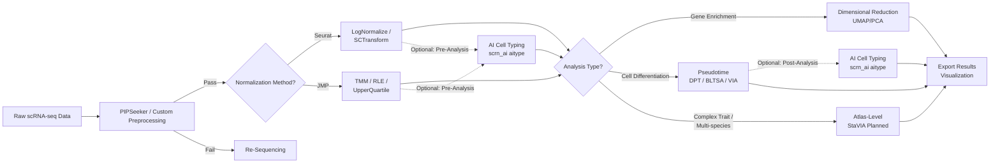

# Single-Cell Transcriptomics Docker Workflow

This repository provides a modular, containerized workflow for **single-cell RNA sequencing (scRNA-seq) data analysis**, supporting both **dense and sparse matrix inputs**.  
While **PIPSeeker** is the default preprocessing module, the workflow is compatible with any equivalent tool that outputs a valid **matrix format** (e.g. `.mtx`, `.h5ad`, `.loom`, `.csv`).

---

## Quick Start Diagram (Mermaid)


```mermaid
flowchart LR
    A[Raw scRNA-seq Data] --> B[PIPSeeker / Custom Preprocessing]
    B -- Pass --> C{Normalization Method?}
    B -- Fail --> D[Re-Sequencing]
    C -- Seurat --> E[LogNormalize /<br/>SCTransform]
    C -- JMP --> F[TMM / RLE /<br/>UpperQuartile]
    E --> G{Analysis Type?}
    F --> G
    G -- Gene Enrichment --> H[Dimensional Reduction<br/>UMAP/PCA]
    G -- Cell Differentiation --> I[Pseudotime<br/>DPT / BLTSA / VIA]
    G -- Complex Trait /<br/>Multi-species --> J[Atlas-Level<br/>StaVIA Planned]
    
    %% AItyping integration (NEW)
    E -.Optional: Pre-Analysis.-> AI[AI Cell Typing<br/>scrn_ai aitype]
    F -.Optional: Pre-Analysis.-> AI
    AI --> G
    I -.Optional: Post-Analysis.-> AI2[AI Cell Typing<br/>scrn_ai aitype]
    AI2 --> K
    
    H --> K[Export Results<br/>Visualization]
    I --> K
    J --> K
```

---

## Workflow Overview

This workflow automates end-to-end single-cell data processing — from initial QC and normalization to dimensional reduction and pseudotime analysis.

```
 ┌────────────────────────┐
 │   Preprocessing        │  ← QC filtering, format conversion
 │   scrn_ai preprocess│     Multi-format input support
 └──────────┬─────────────┘
            │ Pass
            ▼
 ┌───────────────────────────────┐
 │   Normalization               │
 │   scrn_ai normalize        │
 └──────────┬────────────────────┘
    │ Seurat → LogNormalize / SCTransform (R)
    │ JMP → TMM / RLE / UpperQuartile (edgeR)
    │ Basic → log1p / scran / sctransform
            ▼
 ┌────────────────────────┐
 │    Analysis Selection  │
 └──────────┬─────────────┘
    │ Dimensional Reduction → UMAP/PCA
    │ Trajectory Analysis → Pseudotime (DPT/BLTSA/VIA)
    │ Data Export → Multiple formats
            ▼
 ┌────────────────────────────────────┐
 │  Results & Visualization           │
 │  (UMAP plots, pseudotime heatmaps) │
 └────────────────────────────────────┘
```

---

## Unified Docker Container

The workflow runs in a **single, unified Docker container** (`scrn_ai`) that includes all analysis modules for reproducibility and portability. The container is built with:

- **Base OS**: Ubuntu 24.04 LTS
- **Environment Manager**: Micromamba for fast, lightweight package management
- **R Environment**: Includes BLTSA, destiny, and Bioconductor packages
- **Python Environment**: Scanpy, scVI-tools, and analysis frameworks (defined in `env.yml`)

### Current Capabilities

| Module | Implementation | Description |
|---------|---------------|-------------|
| **Preprocessing** | CLI: `scrn_ai preprocess` | QC filtering with multi-format support (.mtx, .h5ad, .loom, .csv). Filters cells/genes by count thresholds and mitochondrial content. |
| **Normalization** | CLI: `scrn_ai normalize` | Unified normalization supporting Seurat (LogNormalize, SCTransform via R), JMP (TMM, RLE, UpperQuartile via edgeR), and basic methods (log1p, scran, sctransform). |
| **AI Cell Type Identification** | CLI: `scrn_ai aitype` | **NEW ✨** - AI-powered cell type annotation using OpenAI GPT models. Supports pre/post-analysis workflows with marker gene auto-detection and confidence scoring. |
| **Dimensional Reduction** | CLI: `scrn_ai umap` | UMAP/PCA visualization for sample exploration with optional cell type overlays. |
| **Pseudotime Analysis** | CLI: `scrn_ai pseudotime` | Unified interface supporting DPT (diffusion pseudotime), BLTSA (branching), and VIA/STAVIA (large-scale) methods. |
| **Utility Functions** | CLI: `scrn_ai ad_merge`, `ad_export`, `ad_norm` | AnnData manipulation tools for merging datasets, exporting to various formats, and basic normalization. |

### Planned Expansions

| Module | Status | Description |
|---------|--------|-------------|
| **Atlas-Level Analysis** | Planned | Multi-species and complex trait pseudotime via StaVIA (separate Docker container). |
| **Mouse and Human Reference Alignment** | Planned | Aligns results with reference mouse and human cell-type databases. |
| **Batch Effect Correction** | Planned | Integration of Harmony, Seurat, scVI batch correction methods. |

### Docker Build

The Dockerfile uses a **multi-stage build** for optimization:

**Stage 1**: Base OS with build utilities  
**Stage 2**: Micromamba installation and Python/R environment setup  
**Stage 3**: BLTSA (R package) installation and CLI configuration

```bash
# Build the unified image
docker build -t scrn_ai:0.1 .

# Run interactively
docker run -it --rm -v $(pwd)/data:/data scrn_ai:0.1 --help
```

---

## Directory Structure

```
scRN_AI/
├── Dockerfile                    # Unified container build
├── pyproject.toml                # PEP 517/518 project metadata & tool config
├── setup.py                      # Legacy setuptools shim (kept for editable installs)
├── env.yml                       # Conda environment specification
├── LICENSE
├── README.md
├── examples/
│   └── sample_config.yaml        # Example workflow configuration
├── tests/
│   ├── quick_test.py
│   ├── test_config_parser.py
│   ├── test_phase1.py
│   ├── test_phase2.py
│   └── test_phase3_milestone1.py
└── scrn_ai/                      # Python package
    ├── __init__.py               # Version & metadata
    ├── cli.py                    # Click CLI — all user-facing commands
    ├── main.py                   # Entrypoint (delegates to cli.main)
    ├── small.py                  # Legacy small-scale workflow
    ├── large.py                  # Legacy large-scale workflow
    ├── config/
    │   ├── __init__.py           # Exposes ConfigParser
    │   ├── parser.py             # YAML config parsing + validation
    │   ├── defaults.yaml         # Default config values
    │   └── schema.yaml           # Validation schema
    ├── workflows/
    │   ├── __init__.py
    │   ├── preprocess.py         # QC filtering (multi-format input)
    │   ├── normalization.py      # Seurat / JMP / log1p / scran / sctransform
    │   ├── visualization.py      # UMAP/PCA plotting
    │   ├── pseudotime.py         # DPT / diffusion / BLTSA / VIA
    │   └── aitype.py             # AI cell typing via OpenAI GPT
    └── utils/
        ├── __init__.py
        ├── openai_client.py      # OpenAI API wrapper with rate limiting
        ├── marker_detection.py   # Cluster marker gene identification
        ├── normalization.py      # Thin wrapper → delegates to workflows
        ├── plot.py               # QC violins, dotplots, pseudotime heatmaps
        ├── export.py             # AnnData → loom / mtx / csv
        └── merge.py              # AnnData concatenation
```

---

## Configuration (`config/config.yaml`)

Example configuration file to control module execution and parameters:

```yaml
input:
  matrix_path: "./input/dataset.mtx"
  metadata_path: "./input/metadata.csv"
  input_format: "mtx"  # Options: mtx, h5ad, loom, csv

preprocessing:
  min_genes_per_cell: 200
  min_cells_per_gene: 3
  max_genes_per_cell: null  # Optional: filter high outliers
  max_mito_pct: null  # Optional: filter high mitochondrial content (e.g., 20.0)

normalization:
  method: "seurat"  # Options: seurat, jmp, log1p, scran, sctransform
  algorithm: "LogNormalize"  # Seurat: LogNormalize, SCTransform | JMP: TMM, RLE, UpperQuartile
  scale_factor: 10000

analysis:
  run_umap: true
  umap_n_neighbors: 15
  umap_min_dist: 0.1
  color_by: "leiden"  # Observation key for coloring
  
  run_pseudotime: true
  pseudotime_method: "dpt"  # Options: dpt, diffusion, bltsa, via
  pseudotime_scale: "small"  # Options: small (<50k cells), large (>50k cells)
  root_cell: null  # Optional: specify root cell for trajectory

output:
  results_dir: "./output/"
  save_intermediate: true  # Save intermediate processing steps
```

---

## Running the Workflow

### Option 1: Direct Command-Line Interface (Local Installation)

After installing with `pip install -e .`, use the `scrn_ai` CLI directly:

```bash
# Step 1: Preprocessing and QC filtering
scrn_ai preprocess \
    --input data/input/dataset.h5ad \
    --output data/output/processed.h5ad \
    --min-genes 200 \
    --min-cells 3 \
    --max-mito-pct 20.0

# Step 2: Normalization with Seurat method
scrn_ai normalize \
    --input data/output/processed.h5ad \
    --output data/output/normalized.h5ad \
    --method seurat \
    --algorithm LogNormalize \
    --scale-factor 10000

# Alternative: JMP normalization with TMM
scrn_ai normalize \
    --input data/output/processed.h5ad \
    --output data/output/normalized_jmp.h5ad \
    --method jmp \
    --algorithm TMM

# Step 3: AI Cell Type Identification (Optional - NEW ✨)
# Pre-analysis: Identify cell types before clustering to guide analysis
export OPENAI_API_KEY="your-api-key-here"
scrn_ai aitype \
    --input data/output/normalized.h5ad \
    --output data/output/cell_types/ \
    --timing pre_analysis \
    --model gpt-4 \
    --species human

# Step 4: UMAP visualization
scrn_ai umap \
    --input data/output/normalized.h5ad \
    --output data/output/umap.png \
    --color-by leiden \
    --n-neighbors 15

# Step 5: Pseudotime analysis (small-scale)
scrn_ai pseudotime \
    --input data/output/normalized.h5ad \
    --output data/output/pseudotime/ \
    --method dpt \
    --scale small

# Alternative: Post-analysis cell typing (annotate pseudotime results)
scrn_ai aitype \
    --input data/output/pseudotime/pseudotime_results.h5ad \
    --output data/output/cell_types_post/ \
    --timing post_analysis \
    --model gpt-4-turbo

# Alternative: Large-scale pseudotime with VIA
scrn_ai pseudotime \
    --input data/output/normalized.h5ad \
    --output data/output/pseudotime_via/ \
    --method via \
    --scale large

# Utility: Merge multiple datasets
scrn_ai ad-merge \
    -i data/batch1.h5ad -i data/batch2.h5ad \
    --outfile data/merged.h5ad

# Utility: Export to different formats
scrn_ai ad-export \
    --infile data/output/normalized.h5ad \
    --outdir data/export/ \
    --format loom
```

### Option 2: Docker Container Execution

Run the same commands using Docker (useful for reproducibility and deployment):

```bash
# Build the Docker image first
docker build -t scrn_ai:0.1 .

# Step 1: Preprocessing and QC filtering
docker run -v $(pwd)/data:/data scrn_ai:0.1 preprocess \
    --input /data/input/dataset.h5ad \
    --output /data/output/processed.h5ad \
    --min-genes 200 \
    --min-cells 3 \
    --max-mito-pct 20.0

# Step 2: Normalization with Seurat method
docker run -v $(pwd)/data:/data scrn_ai:0.1 normalize \
    --input /data/output/processed.h5ad \
    --output /data/output/normalized.h5ad \
    --method seurat \
    --algorithm LogNormalize \
    --scale-factor 10000

# Alternative: JMP normalization with TMM
docker run -v $(pwd)/data:/data scrn_ai:0.1 normalize \
    --input /data/output/processed.h5ad \
    --output /data/output/normalized_jmp.h5ad \
    --method jmp \
    --algorithm TMM

# Step 3: AI Cell Type Identification (Optional - NEW ✨)
# Pre-analysis: Identify cell types before clustering to guide analysis
docker run -e OPENAI_API_KEY="$OPENAI_API_KEY" \
    -v $(pwd)/data:/data scrn_ai:0.1 aitype \
    --input /data/output/normalized.h5ad \
    --output /data/output/cell_types/ \
    --timing pre_analysis \
    --model gpt-4 \
    --species human

# Step 4: UMAP visualization
docker run -v $(pwd)/data:/data scrn_ai:0.1 umap \
    --input /data/output/normalized.h5ad \
    --output /data/output/umap.png \
    --color-by leiden \
    --n-neighbors 15

# Step 5: Pseudotime analysis (small-scale)
docker run -v $(pwd)/data:/data scrn_ai:0.1 pseudotime \
    --input /data/output/normalized.h5ad \
    --output /data/output/pseudotime/ \
    --method dpt \
    --scale small

# Alternative: Post-analysis cell typing (annotate pseudotime results)
docker run -e OPENAI_API_KEY="$OPENAI_API_KEY" \
    -v $(pwd)/data:/data scrn_ai:0.1 aitype \
    --input /data/output/pseudotime/pseudotime_results.h5ad \
    --output /data/output/cell_types_post/ \
    --timing post_analysis \
    --model gpt-4-turbo

# Alternative: Large-scale pseudotime with VIA
docker run -v $(pwd)/data:/data scrn_ai:0.1 pseudotime \
    --input /data/output/normalized.h5ad \
    --output /data/output/pseudotime_via/ \
    --method via \
    --scale large

# Utility: Merge multiple datasets
docker run -v $(pwd)/data:/data scrn_ai:0.1 ad-merge \
    -i /data/batch1.h5ad -i /data/batch2.h5ad \
    --outfile /data/merged.h5ad

# Utility: Export to different formats
docker run -v $(pwd)/data:/data scrn_ai:0.1 ad-export \
    --infile /data/output/normalized.h5ad \
    --outdir /data/export/ \
    --format loom
```

### Option 3: Docker Compose (Full Pipeline Orchestration)

For automated pipeline execution with all modules:

```yaml
version: "3.8"
services:
  # Run with config file
  scrn_ai:
    build: .
    image: scrn_ai:0.1
    volumes:
      - ./data:/data
      - ./config:/config
    command: ["--config", "/config/config.yaml"]

  # Step-by-step pipeline
  preprocess:
    image: scrn_ai:0.1
    volumes:
      - ./data:/data
    command: 
      - "preprocess"
      - "--input"
      - "/data/input/dataset.h5ad"
      - "--output"
      - "/data/output/processed.h5ad"
      - "--min-genes"
      - "200"

  normalize:
    image: scrn_ai:0.1
    depends_on: 
      - preprocess
    volumes:
      - ./data:/data
    command:
      - "normalize"
      - "--input"
      - "/data/output/processed.h5ad"
      - "--output"
      - "/data/output/normalized.h5ad"
      - "--method"
      - "seurat"

  umap:
    image: scrn_ai:0.1
    depends_on: 
      - normalize
    volumes:
      - ./data:/data
    command:
      - "umap"
      - "--input"
      - "/data/output/normalized.h5ad"
      - "--output"
      - "/data/output/umap.png"

  pseudotime:
    image: scrn_ai:0.1
    depends_on: 
      - normalize
    volumes:
      - ./data:/data
    command:
      - "pseudotime"
      - "--input"
      - "/data/output/normalized.h5ad"
      - "--output"
      - "/data/output/pseudotime/"
      - "--method"
      - "dpt"
```

### Option 4: Interactive Docker Session

Run the container interactively for exploratory analysis:

```bash
# Start interactive session
docker run -it --rm -v $(pwd)/data:/data scrn_ai:0.1 bash

# Inside container, run commands directly:
scrn_ai preprocess --input /data/input.h5ad --output /data/processed.h5ad
scrn_ai normalize --input /data/processed.h5ad --output /data/normalized.h5ad --method seurat
scrn_ai umap --input /data/normalized.h5ad --output /data/umap.png
# ... continue with analysis
```

---

## Usage

### 1. Clone Repository
```bash
git clone https://github.com/<your-org>/scRN_AI.git
cd scRN_AI
```

### 2. Install Package (Local Development)

For local development or non-Docker usage:

```bash
# Create virtual environment (recommended)
python -m venv .venv
source .venv/bin/activate  # On macOS/Linux
# or
.venv\Scripts\activate     # On Windows

# Install in editable mode
pip install -e .
```

**Or use the quick verification script**:
```bash
# One-command installation verification
./verify_installation.sh
```

This will automatically:
- Check Python version
- Install the package if needed
- Run comprehensive tests
- Report installation status

### 3. Build Docker Image (For Container Usage)
```bash
docker build -t scrn_ai:0.1 .
```

### 4. Prepare Your Data
```bash
mkdir -p data/input data/output
# Copy your input files to data/input/
# Supported formats: .h5ad, .mtx, .loom, .csv
```

### 4. Run Analysis Pipeline

**Quick Start - Full Pipeline**:
```bash
# Step 1: Preprocessing
docker run -v $(pwd)/data:/data scrn_ai:0.1 preprocess \
    --input /data/input/dataset.h5ad \
    --output /data/output/processed.h5ad \
    --min-genes 200 \
    --min-cells 3

# Step 2: Normalization
docker run -v $(pwd)/data:/data scrn_ai:0.1 normalize \
    --input /data/output/processed.h5ad \
    --output /data/output/normalized.h5ad \
    --method seurat \
    --algorithm LogNormalize

# Step 3: UMAP visualization
docker run -v $(pwd)/data:/data scrn_ai:0.1 umap \
    --input /data/output/normalized.h5ad \
    --output /data/output/umap.png \
    --color-by leiden

# Step 4: Pseudotime analysis
docker run -v $(pwd)/data:/data scrn_ai:0.1 pseudotime \
    --input /data/output/normalized.h5ad \
    --output /data/output/pseudotime/ \
    --method dpt \
    --scale small
```

### 5. Inspect Results
- Processed data: `./data/output/processed/`
- Normalized data: `./data/output/normalized/`
- UMAP visualizations: `./data/output/umap.png`
- Pseudotime trajectories: `./data/output/pseudotime/`

### 6. Available CLI Commands

```bash
# See all available commands
docker run scrn_ai:0.1 --help

# Get help for specific command
docker run scrn_ai:0.1 preprocess --help
docker run scrn_ai:0.1 normalize --help
docker run scrn_ai:0.1 umap --help
docker run scrn_ai:0.1 pseudotime --help
docker run scrn_ai:0.1 ad-merge --help
docker run scrn_ai:0.1 ad-export --help
```

---

## Command Reference

### `scrn_ai preprocess`
**Purpose**: Quality control and filtering of raw scRNA-seq data

**Parameters**:
- `--input, -i`: Input file (.mtx, .h5ad, .loom, .csv) [required]
- `--output, -o`: Output .h5ad file path [required]
- `--min-genes`: Minimum genes per cell (default: 200)
- `--min-cells`: Minimum cells per gene (default: 3)
- `--max-genes`: Maximum genes per cell (filter outliers)
- `--max-mito-pct`: Maximum mitochondrial percentage (e.g., 20.0)

**Example**:
```bash
scrn_ai preprocess \
    --input raw_data.h5ad \
    --output filtered_data.h5ad \
    --min-genes 200 \
    --min-cells 3 \
    --max-mito-pct 20.0
```

### `scrn_ai normalize`
**Purpose**: Normalize count data using various methods

**Parameters**:
- `--input, -i`: Input .h5ad file [required]
- `--output, -o`: Output .h5ad file [required]
- `--method, -m`: Normalization method (seurat, jmp, log1p, scran, sctransform) [default: seurat]
- `--algorithm, -a`: Specific algorithm within method [default: LogNormalize]
  - Seurat: LogNormalize, SCTransform
  - JMP: TMM, RLE, UpperQuartile
- `--scale-factor`: Scaling factor (default: 10000)

**Example**:
```bash
# Seurat LogNormalize
scrn_ai normalize \
    --input filtered_data.h5ad \
    --output normalized_seurat.h5ad \
    --method seurat \
    --algorithm LogNormalize

# JMP TMM normalization
scrn_ai normalize \
    --input filtered_data.h5ad \
    --output normalized_jmp.h5ad \
    --method jmp \
    --algorithm TMM
```

### `scrn_ai umap`
**Purpose**: Generate UMAP visualization for dimensional reduction

**Parameters**:
- `--input, -i`: Input normalized .h5ad file [required]
- `--output, -o`: Output image file (.png, .pdf, etc.) [required]
- `--color-by, -c`: Observation key to color by (default: leiden)
- `--n-neighbors`: Number of neighbors for UMAP (default: 15)
- `--min-dist`: Minimum distance for UMAP (default: 0.1)
- `--cell-types`: Optional CSV with cell type annotations to overlay

**Example**:
```bash
scrn_ai umap \
    --input normalized.h5ad \
    --output umap_plot.png \
    --color-by leiden \
    --n-neighbors 15
```

### `scrn_ai pseudotime`
**Purpose**: Perform pseudotime trajectory analysis

**Parameters**:
- `--input, -i`: Input normalized .h5ad file [required]
- `--output, -o`: Output directory or .h5ad file [required]
- `--method, -m`: Pseudotime method (dpt, diffusion, bltsa, via) [default: dpt]
- `--scale`: Dataset scale (small, large) [default: small]
  - small: DPT, BLTSA for <50k cells
  - large: VIA/STAVIA for >50k cells
- `--root-cell`: Root cell ID for pseudotime calculation

**Example**:
```bash
# Small-scale DPT
scrn_ai pseudotime \
    --input normalized.h5ad \
    --output pseudotime_results/ \
    --method dpt \
    --scale small

# Large-scale VIA
scrn_ai pseudotime \
    --input large_dataset.h5ad \
    --output via_results/ \
    --method via \
    --scale large
```

### `scrn_ai aitype` ✨
**Purpose**: AI-powered cell type identification using OpenAI GPT models

**Parameters**:
- `--input, -i`: Input .h5ad file [required]
- `--output, -o`: Output directory for annotations [required]
- `--timing`: When to perform typing (pre_analysis, post_analysis, both) [default: pre_analysis]
- `--model, -m`: OpenAI model to use (gpt-4, gpt-4-turbo, gpt-3.5-turbo) [default: gpt-4]
- `--confidence-threshold`: Minimum confidence score (0.0-1.0) [default: 0.7]
- `--marker-genes`: Path to custom marker gene CSV (optional)
- `--n-markers`: Number of marker genes per cluster (default: 10)
- `--max-clusters`: Maximum clusters to process (default: 50)
- `--species`: Species (human, mouse, etc.) [default: human]
- `--tissue`: Tissue type (optional, e.g., "brain", "blood")
- `--cluster-key`: Cluster column in .obs (default: leiden)

**Setup**:
Set your OpenAI API key as an environment variable:
```bash
export OPENAI_API_KEY="your-api-key-here"
```

**Example - Pre-Analysis** (annotate before analysis to guide clustering):
```bash
scrn_ai aitype \
    --input normalized.h5ad \
    --output cell_type_annotations/ \
    --timing pre_analysis \
    --model gpt-4 \
    --confidence-threshold 0.7 \
    --species human \
    --tissue brain
```

**Example - Post-Analysis** (annotate after pseudotime to label trajectories):
```bash
scrn_ai aitype \
    --input pseudotime_results.h5ad \
    --output annotations_post/ \
    --timing post_analysis \
    --model gpt-4-turbo \
    --n-markers 15
```

**Example - Custom Markers**:
```bash
scrn_ai aitype \
    --input normalized.h5ad \
    --output custom_annotations/ \
    --marker-genes my_markers.csv \
    --model gpt-3.5-turbo
```

**Output Files**:
- `{timing}_annotations.csv`: Cell type predictions per cluster
- `{timing}_confidence_scores.csv`: Confidence scores and alternative predictions
- `{timing}_marker_genes.csv`: Marker genes used for each cluster
- `{timing}_reasoning.txt`: AI reasoning explanations for each prediction
- `{timing}_low_confidence.csv`: Clusters below confidence threshold (need manual review)
- `{timing}_annotated.h5ad`: Updated AnnData with cell type annotations

**Notes**:
- Requires valid OpenAI API key (charges apply based on API usage)
- GPT-4 provides more accurate results but costs more than GPT-3.5-turbo
- Confidence threshold filters uncertain predictions (increase for stricter results)
- Custom marker genes must be a CSV with columns: cluster, marker_gene

### Utility Commands

**`scrn_ai ad-merge`**: Merge multiple AnnData files
```bash
scrn_ai ad-merge \
    -i batch1.h5ad -i batch2.h5ad -i batch3.h5ad \
    --outfile merged.h5ad
```

**`scrn_ai ad-export`**: Export AnnData to different formats
```bash
scrn_ai ad-export \
    --infile normalized.h5ad \
    --outdir export_folder/ \
    --format loom  # Options: loom, mtx, csv
```

**`scrn_ai ad-norm`**: Basic normalization (utility function)
```bash
scrn_ai ad-norm \
    --infile raw.h5ad \
    --outfile normalized.h5ad \
    --method log1p  # Options: log1p, scran, sctransform, size_factor
```

---

## Normalization Methods Explained

### Seurat Methods (R-based via rpy2)
- **LogNormalize**: Log-normalization with scaling factor (standard Seurat approach)
- **SCTransform**: Variance-stabilizing transformation for UMI count data

### JMP Methods (edgeR-based via rpy2)
- **TMM** (Trimmed Mean of M-values): Robust to compositional differences
- **RLE** (Relative Log Expression): Uses geometric mean as reference
- **UpperQuartile**: Normalizes using upper quartile of counts

### Basic Methods (Python-native)
- **log1p**: Simple log(x+1) transformation
- **scran**: Deconvolution-based size factor normalization
- **sctransform**: Variance stabilization (Python implementation)
- **size_factor**: Basic size factor normalization

---

## Pseudotime Methods Explained

### Small-Scale Methods (<50k cells)
- **DPT** (Diffusion Pseudotime): Scanpy's diffusion-based pseudotime
- **Diffusion**: Diffusion maps for trajectory inference
- **BLTSA**: Branching trajectory inference (R-based)

### Large-Scale Methods (>50k cells)
- **VIA/STAVIA**: Scalable trajectory inference for large datasets

---

## Docker Image Architecture

The `scrn_ai` Docker image is built using a **three-stage multi-stage build** for optimization and reproducibility:

### Stage 1: Base OS Setup
```dockerfile
FROM ubuntu:24.04 AS base
```
- **Base Image**: Ubuntu 24.04 LTS for stability and long-term support
- **Build Tools**: gcc, g++, make, git, curl, ca-certificates
- **Runtime Libraries**: libgl1 (for matplotlib Qt backend)
- **APT Cache**: Cleaned to reduce image size

### Stage 2: Micromamba Environment
```dockerfile
ARG MAMBA_VER=latest
ARG MAMBA_ROOT=/opt/conda
```
- **Package Manager**: Micromamba (lightweight, fast alternative to Conda)
- **Installation**: Direct binary download from `micro.mamba.pm` API
- **Environment**: Created from `env.yml` specification
- **Activation**: Automatically activates `scrn_ai` environment
- **Python/R Packages**: Scanpy, scVI-tools, matplotlib, pandas, numpy, etc.

### Stage 3: R Packages and CLI
```dockerfile
WORKDIR /opt/scrn_ai
```
- **R Packages**: Matrix, FNN, RSpectra, igraph, destiny (Bioconductor)
- **BLTSA**: Cloned from GitHub to `/opt/BLTSA`
- **Python CLI**: `scrn_ai` source code installed at `/opt/scrn_ai`
- **Entry Point**: `scrn_ai` command configured as container entrypoint
- **Default Command**: `--help` (shows usage when container runs without arguments)

### Key Design Decisions

| Aspect | Choice | Rationale |
|--------|--------|-----------|
| **Base OS** | Ubuntu 24.04 | Latest LTS with long-term support and modern package versions |
| **Package Manager** | Micromamba | 10x faster than Conda, smaller binary, same functionality |
| **Build Strategy** | Multi-stage | Separates build dependencies from runtime, reduces final image size |
| **R Integration** | Rscript + BiocManager | Ensures R packages are installed in same environment as Python |
| **CLI Design** | Single entrypoint | Unified interface for all workflow modules |
| **Environment** | Pre-activated | No manual activation needed, ready to use immediately |

### Environment File (`env.yml`)

Your environment should include core dependencies:

```yaml
name: scrn_ai
channels:
  - conda-forge
  - bioconda
  - defaults
dependencies:
  - python=3.11
  - r-base>=4.3
  - scanpy
  - scvi-tools
  - matplotlib
  - pandas
  - numpy
  - scipy
  - scikit-learn
  - umap-learn
  - leidenalg
  - louvain
  # Add more as needed
```

### Image Size Optimization

The multi-stage build and APT cache cleanup help keep the image size manageable:
- Base stage: ~500 MB
- With micromamba + environment: ~2-3 GB
- With R packages and BLTSA: ~3-4 GB (final)

### Building and Tagging

```bash
# Build with version tag
docker build -t scrn_ai:0.1 .

# Build with latest tag
docker build -t scrn_ai:latest .

# Build with custom build args
docker build --build-arg MAMBA_VER=1.5.6 -t scrn_ai:custom .
```

---

## Testing Your Installation

After installing scRN_AI, verify that everything is working correctly:

### Quick Test (Recommended)

```bash
# Navigate to the scRN_AI directory
cd /path/to/scRN_AI

# Run the quick verification test
python quick_test.py
```

**Expected Output**:
```
============================================================
Results: 11/11 passed, 0/11 failed
============================================================

🎉 All commands working correctly (Phase 1 + Phase 2)!
```

If you see **11/11 passed**, your installation is correct! ✅

### What Gets Tested

The quick test verifies:
- ✅ All 11 CLI commands are accessible
- ✅ Main help system works
- ✅ Phase 1 commands (preprocess, normalize, umap, pseudotime)
- ✅ Phase 2 commands (aitype - AI cell typing)
- ✅ Utility commands (merge, export, norm, small, large)

### Additional Testing

For more comprehensive testing, see our detailed **[Testing Guide](TESTING.md)** which covers:
- Phase 1 and Phase 2 test suites
- Module import verification
- Docker container testing
- Troubleshooting common issues
- Creating test data
- CI/CD integration examples

### Quick Verification Commands

```bash
# Test individual commands
scrn_ai --help
scrn_ai preprocess --help
scrn_ai normalize --help
scrn_ai aitype --help

# Test module imports
python -c "from scrn_ai.workflows.aitype import run; print('✅ Modules OK')"

# Check package installation
pip list | grep sc-toolkit
```

### Troubleshooting

If tests fail:

1. **Reinstall the package**:
   ```bash
   pip install --force-reinstall -e .
   ```

2. **Check Python version** (requires 3.8+):
   ```bash
   python --version
   ```

3. **Verify environment activation**:
   ```bash
   which python
   which scrn_ai
   ```

See the full [TESTING.md](TESTING.md) guide for detailed troubleshooting steps.

---

## Notes

- **Unified Container**: All workflow modules run in a single Docker image for simplified deployment
- **PIPSeeker is optional** — any preprocessing tool that generates valid sparse or dense matrices can be used
- **Modular CLI**: Access individual analysis steps through the `scrn_ai` command-line interface
- **Multi-stage Build**: Optimized Dockerfile with separate stages for base OS, environment setup, and R packages
- **BLTSA Integration**: R-based BLTSA pseudotime analysis is pre-installed at `/opt/BLTSA`
- **Micromamba**: Uses lightweight micromamba instead of full Anaconda for faster builds
- All parameters and paths are configurable via `config/config.yaml` or CLI arguments
- Compatible with local Docker, Docker Compose, and cloud container orchestration platforms

### Current Implementation Status

**✅ Phase 1 Complete**:
- ✅ Multi-stage Docker build with Ubuntu 24.04
- ✅ Micromamba-based Python/R environment management
- ✅ **Preprocessing module** (`scrn_ai preprocess`)
  - Multi-format input support (.mtx, .h5ad, .loom, .csv)
  - QC filtering (gene/cell count thresholds, mitochondrial content)
- ✅ **Normalization module** (`scrn_ai normalize`)
  - Seurat methods: LogNormalize, SCTransform (via R/rpy2)
  - JMP methods: TMM, RLE, UpperQuartile (via edgeR/rpy2)
  - Basic methods: log1p, scran, sctransform (Python-native)
- ✅ **UMAP visualization** (`scrn_ai umap`)
  - Automatic PCA and neighbor computation
  - Cell type overlay support
  - Configurable parameters (n_neighbors, min_dist)
- ✅ **Unified pseudotime module** (`scrn_ai pseudotime`)
  - Small-scale: DPT, diffusion, BLTSA
  - Large-scale: VIA/STAVIA
  - Unified interface with scale parameter
- ✅ **Utility functions**
  - `ad-merge`: Merge multiple AnnData files
  - `ad-export`: Export to loom/mtx/csv formats
  - `ad-norm`: Basic normalization methods
- ✅ **Package installation** (`setup.py`)
  - Installable via `pip install -e .`
  - Creates `scrn_ai` command entry point
  - Docker-compatible

**✅ Phase 2 Complete** (AI-Powered Cell Type Identification):
- ✅ **AItyping module** (`scrn_ai aitype`)
  - OpenAI GPT-4/GPT-4-turbo/GPT-3.5-turbo integration
  - Pre-analysis cell typing (guide clustering)
  - Post-analysis cell typing (annotate trajectories)
  - Automatic marker gene detection
  - Custom marker gene support
  - Confidence scoring and filtering
  - Multi-format output (6 file types)
- ✅ **OpenAI API client** (`scrn_ai.utils.openai_client`)
  - Rate limiting and retry logic
  - Batch processing support
  - Prompt engineering for cell typing
- ✅ **Marker detection utilities** (`scrn_ai.utils.marker_detection`)
  - HVG identification
  - Differential expression analysis
  - Gene filtering (ribosomal/mitochondrial/HSP)
- ✅ **Testing infrastructure**
  - Quick test suite (11/11 commands)
  - Phase 1 and Phase 2 test suites
  - Comprehensive testing guide

**🚧 In Development (Phase 3)** (Configuration & Orchestration):
- ⏳ YAML config file parser for workflow automation
- ⏳ Enhanced docker-compose orchestration
- ⏳ State management and checkpoints
- ⏳ Full integration testing with sample datasets

**📋 Planned (Phase 4+)**:
- ☐ Atlas-level analysis with StaVIA (separate container)
- ☐ Mouse and human reference cell type database alignment
- ☐ Batch effect correction modules (Harmony, Seurat integration, scVI)
- ☐ Integration with additional LLM models (Claude, Llama)
- ☐ Web-based dashboard for interactive visualization

---

## Citation

If you use this workflow, please cite:
- Relevant single-cell analysis tools (Seurat, BLTSA, StaVIA, etc.)
- The PIPSeeker or alternative preprocessing framework you employed
- This Dockerized workflow repository (once published)

---

**Maintainer:** [Your Name or Organization]  
**License:** MIT  
**Contact:** [your.email@domain.com]
